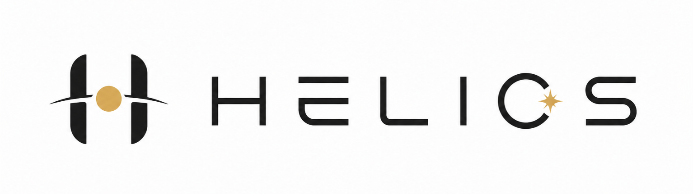

  

# Helios

A space simulation engine that takes you from interstellar space to standing on a planetary surface — in one seamless flight, with no loading screens, built on real astronomical data.

Written from scratch in C++ and Vulkan. Open source under AGPL-3.0, with commercial licenses available for companies that can't work with copyleft.

> **Status: pre-alpha / design phase.** There is no build to download yet. What exists today is a fully worked-out architecture, a decision log, and a roadmap — the code follows it milestone by milestone. Watch the repo if you want to see an engine grow from the first triangle.

## What Helios is

SpaceEngine proved people want to fly through a scientifically plausible universe. Helios aims at the same experience with three differences:

- **Open source.** You can read every line of the LOD system, the coordinate math, the atmosphere. If something is wrong, you can fix it. If something is interesting, you can build on it.
- **Real data first.** Planet positions come from real ephemerides (VSOP87, later JPL/SPICE). Stars come from real catalogs (HYG, later Gaia subsets). Terrain on mapped bodies comes from real elevation data (SRTM, MOLA, LOLA) with procedural detail below the data's resolution — clearly labeled as such, never passed off as measurement.
- **Built to be extended.** Deterministic terrain generation (same input always produces the same planet), a headless mode for running generation without a display, and hard module boundaries. The goal is that a researcher or a small studio can rip out one subsystem, improve it, and put it back.

## What v1 promises — exactly

Seamless free flight from interplanetary distance down to a camera 2 m above a planetary surface, with:

- stable sub-millimeter precision at every altitude (no jitter, no popping origin shifts)
- continuous level-of-detail from orbit to ~1 m geometry near the camera
- one Earth-like atmosphere (Bruneton precomputed scattering)
- physically-based HDR exposure that handles the sun and starlight in the same frame
- the Sun, Earth, Moon and planets at their real positions for any date

And explicitly **not** in v1: collision, a walkable avatar, vegetation, buildings, water simulation, n-body physics, black holes. Those live at the bottom of the [roadmap](ROADMAP.md), after the foundation earns them.

## Technical foundation

The full reasoning is in [docs/DECISIONS.md](docs/DECISIONS.md) — every contested choice, the ruling, and why the runner-up lost. The short version:

| Problem | Decision |
|---|---|
| Precision at 10¹³ m | Hierarchical reference frames (barycentric → body-fixed → tile-local), `double` on CPU, camera-relative `float32` handoff to GPU each frame |
| Depth over astronomical ranges | Reversed-Z, `D32_SFLOAT`, infinite far plane (not logarithmic depth) |
| Planet LOD | Cube-sphere quadtree, 33×33 grid patches, screen-space-error selection, geomorphing + skirts. GPU-driven culling later; mesh shaders/CBT much later |
| API baseline | Vulkan 1.3 — dynamic rendering, timeline semaphores, descriptor indexing, buffer device address |
| Shaders | Slang, compiled offline to SPIR-V, pinned compiler version |
| Ephemerides | VSOP87 + ELP2000 first, SPICE/DE440 behind the same interface later |
| Terrain generation | GPU compute, deterministic, structured as a data-driven pass chain (erosion and crater passes slot in without architectural change) |

Hardware target: a mid-range consumer GPU (Vulkan 1.3, ~2019 or newer). Quality scales up on bigger hardware; it does not require it.

## Building

Nothing to build yet. The first milestone (["Impossible depth range"](ROADMAP.md#milestone-1--impossible-depth-range)) will land with build instructions for Linux, Windows and macOS-via-MoltenVK-where-feasible.

## Contributing

Contributions are welcome once the skeleton lands — but read [CONTRIBUTING.md](CONTRIBUTING.md) first. Two things are non-negotiable:

1. **Every contributor signs the [CLA](CLA.md).** Helios is dual-licensed, and that only works if copyright stays consolidated. No CLA, no merge — regardless of how good the patch is.
2. **No code from GPL projects.** Cosmonium, Stellarium, Celestia and most black-hole demos are study-only references. One pasted GPL snippet destroys the licensing model for everyone.

## License

- **Community:** [AGPL-3.0](LICENSE). Free to use, modify and redistribute — including commercially — as long as your derived work is also AGPL and you provide source to your users, network users included.
- **Commercial:** if AGPL doesn't work for you (closed-source products, proprietary forks), a commercial license is available. See [LICENSING.md](LICENSING.md).

Copyright © 2026 Proceduralabs — Leonhard [SURNAME — fill in]. <!-- TODO: real legal name before going public -->
